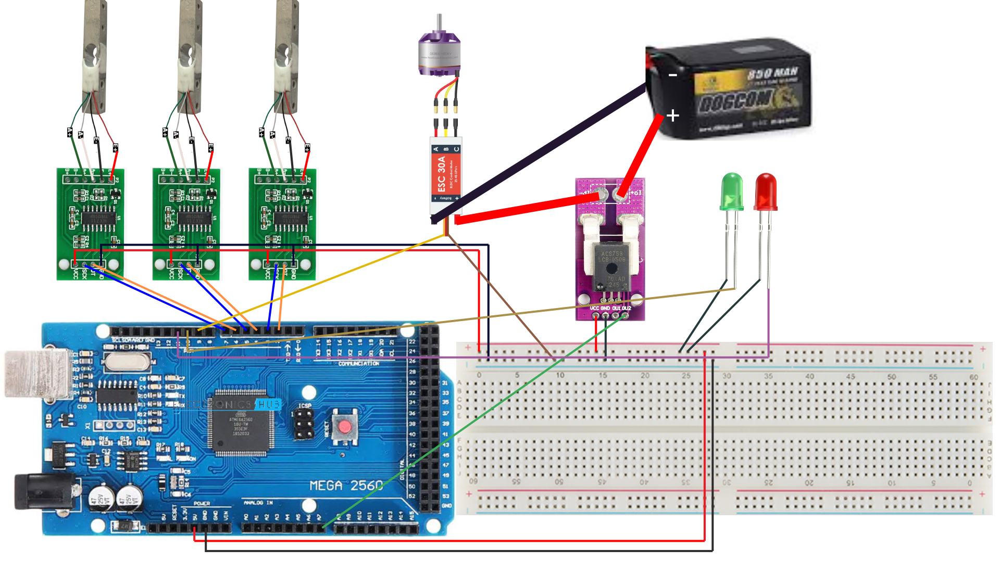

# Thrust Bench - User Manual

## Introduction

This documentation introduces the purpose, design, and applications of the thrust test bench developed for drones. This setup is designed to measure the thrust generated by drone propulsion systems, aiding in the enhancement and optimization of drone performance.

### Key Features

-   Evaluates and measures thrust of drone propulsion systems.
-   Aids in optimizing power efficiency, performance, and reliability.
-   Collects crucial data for refining designs and enhancing reliability.

## Before You Begin

### Requirements

-   **Software:**
    -   Arduino IDE with necessary libraries (`HX711.h`, `Servo.h`).
    -   Python 3.6+ with libraries (`PyGame`, `Serial`, `Matplotlib`).
-   **Hardware:**
    -   BLDC motor and Electronic Speed Controller (ESC).
    -   Load sensor (3x) and HX711 ADC (3x).
    -   ACS758LCB-050B Hall sensor.
    -   Jumper cables, LEDs (Green and Red), Potentiometer (optional).

## Installation

### Software Installation

1.  **Arduino Libraries:**
    -   Install `HX711.h` and `Servo.h` via Arduino IDE's Library Manager.
2.  **Python Libraries:**
    -   Install `PyGame`, `pyserial`, and `matplotlib` using pip:
        ```bash
        pip install pygame pyserial matplotlib
        ```

### Hardware Setup

1.  Connect the load sensors to the HX711 ADCs and then to the Arduino MEGA 2560, following the provided diagram.
2.  Interface the ACS758 sensor with the ESC and Arduino for current sensing.
3.  Connect LEDs and optional potentiometer to the Arduino as indicated.

## Circuit Diagram




## Hardware Connections

1.  **Load Sensor-HX711 Interface:**
    -   RED: E+
    -   BLACK: E-
    -   WHITE: A-
    -   GREEN: A+
2.  **HX711-Arduino Interface:**
    -   VCC: 5V
    -   GND: GND
    -   SCL (for 3 sensors): 2, 4, 6
    -   SCK (for 3 sensors): 3, 5, 7
3.  **ACS758-ESC Interface:**
    -   Connect the positive terminal of the battery to IP+ of ACS758.
    -   Connect IP- of ACS758 to the positive terminal of ESC.
    -   Connect the negative terminal of ESC to the negative terminal of the battery.
4.  **ACS758-Arduino Interface:**
    -   VCC: 5V
    -   GND: GND
    -   OU2: A7
5.  **LED-Arduino Interface:**
    -   Connect the short leg of the LED to GND.
    -   Connect the long leg of the LED to Arduino Ports 10 and 11.

## Usage

### Calibration

1.  **HX711 Calibration:**
    -   Run the `Load_calibration` sketch on Arduino.
    -   Follow serial monitor instructions to calibrate each load sensor.
2.  **ESC Calibration:**
    -   (Optional) Calibrate ESC through the Arduino if necessary, using the provided calibration sketch.

### Running the Program

1.  Open and update the `Thrust Bench Source` file with calibration factors.
2.  Upload the code to Arduino and note the COM port.
3.  Run `main.py` in Python, ensuring the Arduino IDE is closed.

### Functionalities

-   **General Window:** Displays real-time sensor data.
-   **Throttle Control:** Adjust motor RPM via the "Set Throttle" input.
-   **Limits Window:** Set voltage and current limits.
-   **HALT Button:** Emergency shutdown/start.
    -   Pressing "HALT" shuts down the Thrust Bench.
    -   In HALT state, no inputs affect the system, and the motor cannot spin.
    -   The red LED glows in HALT state.
    -   Pressing "HALT" again restarts the system.
-   **Data Collection:** Save sensor data to a CSV file.
    -   Use "Start" to begin data capture.
    -   Use "Stop" to end data capture and save the file.
    -   "Choose Save Location" allows changing the default "Downloads" directory.
-   **Custom Setup:** Upload custom configurations via YAML files (feature to be added).
    -   "Browse" to select a YAML config file.
    -   "Use" to apply the configurations.

## Troubleshooting

-   **Installation Issues:**
    -   Ensure all software dependencies are correctly installed.
    -   Verify hardware connections against the circuit diagram.
-   **Calibration Problems:**
    -   Double-check sensor connections and repeat calibration steps.
-   **Operational Errors:**
    -   Use the HALT functionality for emergency shutdowns.
    -   Consult the serial monitor for error messages during operation.

## Additional Notes

-   The application includes features for monitoring current, voltage, torque, and thrust.
-   Future updates will include graphing functionalities and custom setup options.
